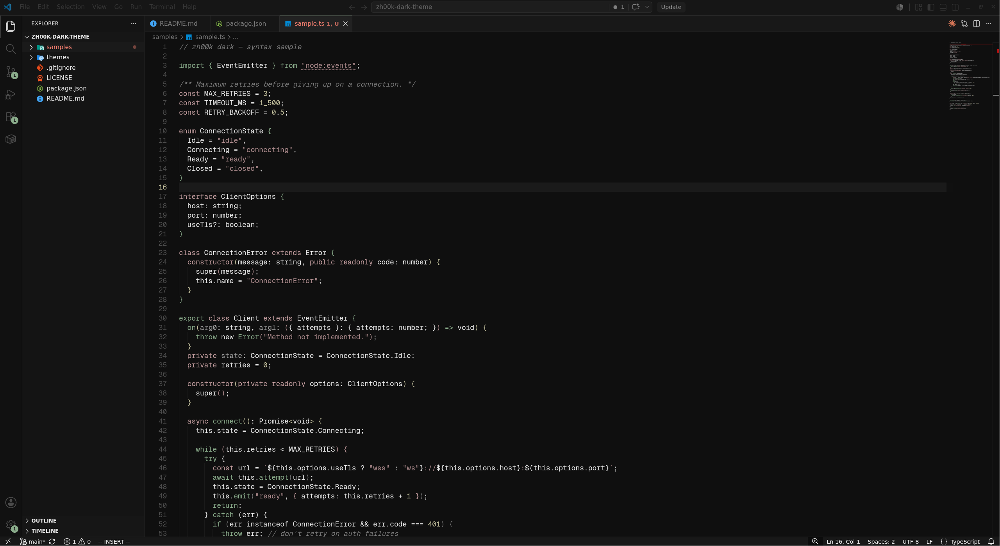

# zh00k dark (VS Code theme)

A minimal dark VS Code theme ported from zh00k's Linux rice:

- **UI chrome** (sidebar, tabs, status bar, panels, inputs) pulled from the `zh00k-dark` Firefox theme.
- **Syntax colors** pulled from the "Mountain Home" palette used in zh00k's `_vimrc` (green for keywords/functions, muted mauve for strings/exceptions, tan for constants, grey comments).



## Installation

### From the Marketplace

1. Open the Extensions view (`Ctrl+Shift+X` / `Cmd+Shift+X`).
2. Search for **zh00k Dark**.
3. Click **Install**.
4. Open the Command Palette → `Preferences: Color Theme` → select **zh00k Dark**.

### Manual installation

1. Clone this repo into your VS Code extensions directory:
   - Linux/macOS: `~/.vscode/extensions/zh00k-dark-theme`
   - Windows: `%USERPROFILE%\.vscode\extensions\zh00k-dark-theme`
2. Restart VS Code.
3. Open the Command Palette → `Preferences: Color Theme` → select **zh00k dark**.

## Building from source

```bash
npm install -g @vscode/vsce
vsce package
```

This produces a `.vsix` file you can install via `Extensions: Install from VSIX...` in the Command Palette.
